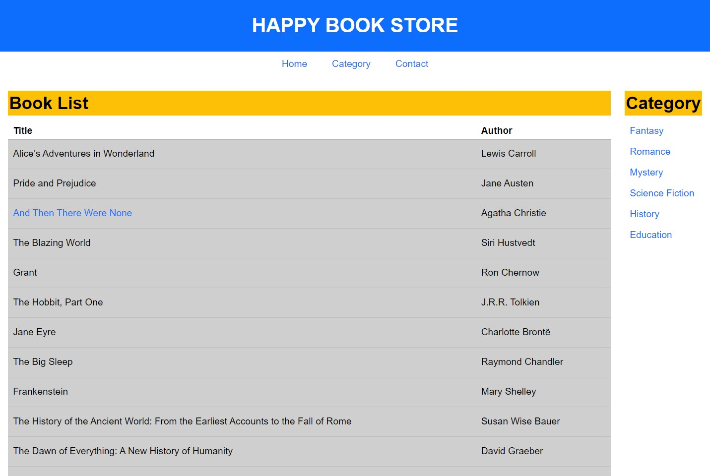
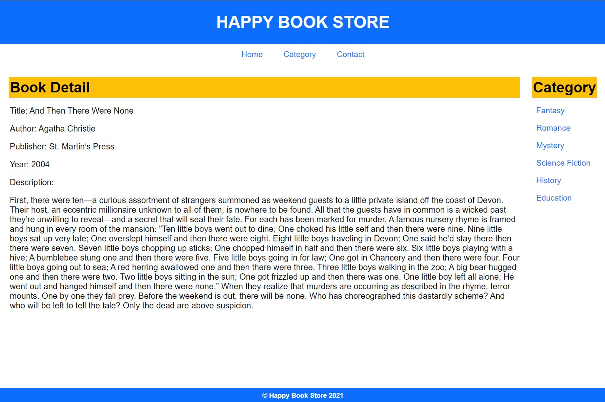
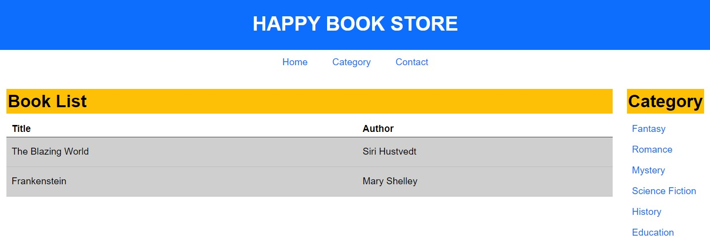
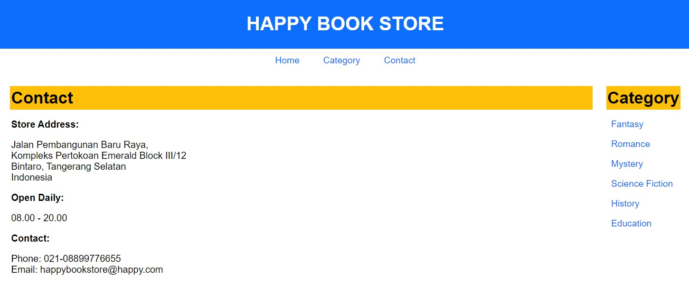

# HappyBookStore

Happy Book Store is a simple web application for seeing a store's books. As a user, you can look what book is available in the store by visiting the home page or by choosing a category, the web application will then redirect you to a page where only books associated with that category is shown, for example if you choose Fantasy category, the application will only show you Fantasy-genre books. This web application was made by HTML and CSS with PHP logic and Laravel 8 Framework that uses MySQL to connect to the database. 

Happy Book Store was built with Model View Controller (MVC) architecture.

# Startup Guide
1. Install XAMPP, then start Apache and MySQL module (make sure these two modules are active, otherwise the application can't connect to the database and won't start).
2. Go to http://localhost/phpmyadmin/.
3. Create a database named 'happybookstoredb'.
4. Open the project's directory in a terminal and run the command: 
    - *php artisan migrate:refresh* (to migrate tables to the database)
    - *php artisan db:seed* (to fill those table with values)
    - *php artisan serve*
5. Open the link given after the last command to open the web application.

Below is the preview and/or flow of the application:
# (1/4) Home Page

This page is where the user will land after clicking the link given after the php artisan serve command. Here, the user will be shown the list of all books available in Happy Book Store. Books will be listed by their title and their author. Users can navigate to Book Detail page by clicking the book title in the lists.

# (2/4) Book Detail Page

Users can get to this page by clicking the book's title text. In this page, users can see the book's detailed information, other than the title and author, users will be able to see the book's publisher, year of publication, and the description (synopsis) of the book chosen.

# (3/4) Category Page

This page is accessible by clicking dropdown menu from the Category navigation bar on the top, or by clicking on of the category lists on the right sidebar. After user clicked one of the category, they will be redirected to the Category page. Here user can see a list of books that is associated with that genre only. So if the user want to see what fantasy books are available, then they can click on the fantasy category.

# (4/4) Contact Page

Finally, the Contact page is just a static page showing Happy Book Store's information such as address, time of operation, and contact info.
